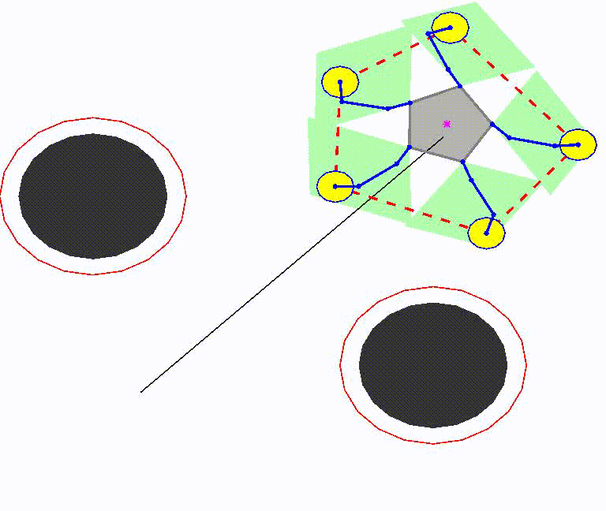

## Distributed Cooperative Control of Redundant Mobile Manipulators With Safety Constraints

This repo contains the simulation codes for the distributed cooperative control of multiple mobile manipulator systems.

## Related Paper

Distributed Cooperative Control of Redundant Mobile Manipulators With Safety Constraints.

IEEE Transactions on Cybernetics 2021. DOI: [10.1109/tcyb.2021.3104044](https://ieeexplore.ieee.org/document/9525159/).

## Run The Simulation

- Install RTE by following the procedures in https://github.com/star2dust/Robotics-Toolbox

- Run "main_robot_simu.m"

## Simulation Result

The simulation result should be like this:

For more results and videos, See in [Youtube](https://youtu.be/J56E-t7DbkA).
